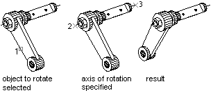

# Вращение в 3D

С помощью метода `TransformBy` или, конкретнее, метода `Rotation` матрицы трансформации можно применять к двумерным объектам поворот вокруг заданной точки. Направление вращения для двумерных объектов — вокруг оси Z. Для трехмерных объектов ось вращения не ограничивается осью Z, в качестве оси вращения может быть указан произвольный трехмерный вектор. 



В примере ниже создается солид в виде параллепипеда, и далее он вращается на 30 градусов вокруг вектора, заданного двумя точками. 

```cs
using Teigha.Runtime;
using HostMgd.ApplicationServices;
using Teigha.DatabaseServices;
using Teigha.Geometry;
[CommandMethod("Rotate_3DBox")]
public static void Rotate_3DBox()
{
    // Get the current document and database, and start a transaction
    Document acDoc = Application.DocumentManager.MdiActiveDocument;
    Database acCurDb = acDoc.Database;
    using (Transaction acTrans = acCurDb.TransactionManager.StartTransaction())
    {
        // Open the Block table for read
        BlockTable acBlkTbl;
        acBlkTbl = acTrans.GetObject(acCurDb.BlockTableId,
                                        OpenMode.ForRead) as BlockTable;
        // Open the Block table record Model space for write
        BlockTableRecord acBlkTblRec;
        acBlkTblRec = acTrans.GetObject(acBlkTbl[BlockTableRecord.ModelSpace],
                                        OpenMode.ForWrite) as BlockTableRecord;
        // Create a 3D solid box
        using (Solid3d acSol3D = new Solid3d())
        {
            acSol3D.CreateBox(5, 7, 10);
            // Position the center of the 3D solid at (5,5,0)
            acSol3D.TransformBy(Matrix3d.Displacement(new Point3d(5, 5, 0) -
                                                        Point3d.Origin));
            Matrix3d curUCSMatrix = acDoc.Editor.CurrentUserCoordinateSystem;
            CoordinateSystem3d curUCS = curUCSMatrix.CoordinateSystem3d;
            // Rotate the 3D solid 30 degrees around the axis that is
            // defined by the points (-3,4,0) and (-3,-4,0)
            Vector3d vRot = new Point3d(-3, 4, 0).
                            GetVectorTo(new Point3d(-3, -4, 0));
            acSol3D.TransformBy(Matrix3d.Rotation(0.5236,
                                                    vRot,
                                                    new Point3d(-3, 4, 0)));
            // Add the new object to the block table record and the transaction
            acBlkTblRec.AppendEntity(acSol3D);
            acTrans.AddNewlyCreatedDBObject(acSol3D, true);
        }
        // Save the new objects to the database
        acTrans.Commit();
    }
}
```
