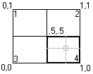

Активный ВЭ хранится в таблице Viewports (ViewportTable) как запись с именем "*Active", которая не является уникальным именем, поскольку все плиточные видовые экраны, отображаемые в данный момент в пространстве модели, имеют имя "*Active". Каждому отображаемому видовому экрану присваивается номер. Номер активного видового экрана можно получить следующим образом: 

* Используя значение системной переменной CVPORT; 
  Свойство Number у ViewportTableRecord (его можно получить используя свойство Editor.ActiveViewportId) в nanoCAD .NET API не реализовано.

Получив активный ВЭ, можно управлять его параметрами отображения, активировать режимы видимости сетки, изменять размер самого ВЭ. Разделенные (плиточные) ВЭ определяются двумя угловыми точками: левым нижним и правым верхним углами; их значения хранятся соответственно в изменяемых свойствах LowerLeftCorner и UpperRightCorner соответственно. Одиночный ВЭ по умолчанию имеет LowerLeftCorner со значением (0,0) и UpperRightCorner = (1,1). Левый нижний угол окна чертежа обычно представляется точкой (0,0), а правый верхний :: точкой (1,1) независимо от числа разделенных ВЭ на пространстве модели. Когда отображено более одного ВЭ, левый нижний и правый верхний углы могут иметь отличные значения, но в одном видовом экране всегда нижний левый угол будет равен (0,0), а в другом : верхний правый угол равен (1,1). Для случая расположения сетки экранов 2х2 эти свойства будут определяться следующим образом: 



По данному примеру:

* Viewport 1:LowerLeftCorner = (0, 0.5), UpperRightCorner = (0.5, 1) 

* Viewport 2:LowerLeftCorner = (0.5, 0.5), UpperRightCorner = (1, 1) 

* Viewport 3:LowerLeftCorner = (0, 0), UpperRightCorner = (0.5, .5) 

* Viewport 4:LowerLeftCorner = (0.5, 0), UpperRightCorner = (1, 0.5) 
  
  ## Создание конфигурации с двумя горизонтальными видовыми экранами
  
  Код ниже создает 2 горизонтально-ориентированных ВЭ и переопределяет активный вид с их учетом. 

```cs
using Autodesk.AutoCAD.ApplicationServices;
using Autodesk.AutoCAD.DatabaseServices;
using Autodesk.AutoCAD.Runtime;
using Autodesk.AutoCAD.Geometry;

[CommandMethod("CreateModelViewport")]
public static void CreateModelViewport()
{
    // Get the current database
    Document acDoc = Application.DocumentManager.MdiActiveDocument;
    Database acCurDb = acDoc.Database;

    // Start a transaction
    using (Transaction acTrans = acCurDb.TransactionManager.StartTransaction())
    {
        // Open the Viewport table for read
        ViewportTable acVportTbl;
        acVportTbl = acTrans.GetObject(acCurDb.ViewportTableId,
                                        OpenMode.ForRead) as ViewportTable;

        // Check to see if the named view 'TEST_VIEWPORT' exists
        if (acVportTbl.Has("TEST_VIEWPORT") == false)
        {
            // Open the View table for write
            acTrans.GetObject(acCurDb.ViewportTableId, OpenMode.ForWrite);

            // Add the new viewport to the Viewport table and the transaction
            using (ViewportTableRecord acVportTblRecLwr = new ViewportTableRecord())
            {
                acVportTbl.Add(acVportTblRecLwr);
                acTrans.AddNewlyCreatedDBObject(acVportTblRecLwr, true);

                // Name the new viewport 'TEST_VIEWPORT' and assign it to be
                // the lower half of the drawing window
                acVportTblRecLwr.Name = "TEST_VIEWPORT";
                acVportTblRecLwr.LowerLeftCorner = new Point2d(0, 0);
                acVportTblRecLwr.UpperRightCorner = new Point2d(1, 0.5);

                // Add the new viewport to the Viewport table and the transaction
                using (ViewportTableRecord acVportTblRecUpr = new ViewportTableRecord())
                {
                    acVportTbl.Add(acVportTblRecUpr);
                    acTrans.AddNewlyCreatedDBObject(acVportTblRecUpr, true);

                    // Name the new viewport 'TEST_VIEWPORT' and assign it to be
                    // the upper half of the drawing window
                    acVportTblRecUpr.Name = "TEST_VIEWPORT";
                    acVportTblRecUpr.LowerLeftCorner = new Point2d(0, 0.5);
                    acVportTblRecUpr.UpperRightCorner = new Point2d(1, 1);

                    // To assign the new viewports as the active viewports, the 
                    // viewports named '*Active' need to be removed and recreated
                    // based on 'TEST_VIEWPORT'.

                    // Step through each object in the symbol table
                    foreach (ObjectId acObjId in acVportTbl)
                    {
                        // Open the object for read
                        ViewportTableRecord acVportTblRec;
                        acVportTblRec = acTrans.GetObject(acObjId,
                                                            OpenMode.ForRead) as ViewportTableRecord;

                        // See if it is one of the active viewports, and if so erase it
                        if (acVportTblRec.Name == "*Active")
                        {
                            acTrans.GetObject(acObjId, OpenMode.ForWrite);
                            acVportTblRec.Erase();
                        }
                    }

                    // Clone the new viewports as the active viewports
                    foreach (ObjectId acObjId in acVportTbl)
                    {
                        // Open the object for read
                        ViewportTableRecord acVportTblRec;
                        acVportTblRec = acTrans.GetObject(acObjId,
                                                            OpenMode.ForRead) as ViewportTableRecord;

                        // See if it is one of the active viewports, and if so erase it
                        if (acVportTblRec.Name == "TEST_VIEWPORT")
                        {
                            ViewportTableRecord acVportTblRecClone;
                            acVportTblRecClone = acVportTblRec.Clone() as ViewportTableRecord;

                            // Add the new viewport to the Viewport table and the transaction
                            acVportTbl.Add(acVportTblRecClone);
                            acVportTblRecClone.Name = "*Active";
                            acTrans.AddNewlyCreatedDBObject(acVportTblRecClone, true);
                        }
                    }

                    // Update the display with the new tiled viewports arrangement
                    acDoc.Editor.UpdateTiledViewportsFromDatabase();
                }
            }

            // Commit the changes
            acTrans.Commit();
        }

        // Dispose of the transaction
    }
}
```