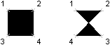

# Создание областей с заполнением (Solid)

Вы можете создавать треугольные и четырёхугольные области, залитые цветом (Solid). 
**Примечание**: для оптимизации производительности рекомендуется устанавливать значение переменной FILLMODE в позицию "выкл" на период создания областей. При создании четырёхугольной области, залитой сплошной заливкой, её форма определяется последовательностью третьей и четвёртой точками (см. картинку ниже): 



Первые 2 вершины определяют первое ребро полигона. Третья точка определяет диагональ напротив второй точки. Если четвертая точка = третьей точке, то создается треугольное заполнение. ##  Создание заполнения  
Пример ниже формирует четырёхугольное тело (фигуру типа "галстук-бабочка") по опорным координатам (0, 0, 0), (5, 0, 0), (5, 8, 0), (0, 8, 0). Также создается заполнение в прямоугольнике, ограниченном координатами (10, 0, 0), (15, 0, 0), (10, 8, 0), (15, 8, 0). 

```cs
using Autodesk.AutoCAD.Runtime;
using Autodesk.AutoCAD.ApplicationServices;
using Autodesk.AutoCAD.DatabaseServices;
using Autodesk.AutoCAD.Geometry;

[CommandMethod("Add2DSolid")]
public static void Add2DSolid()
{
    // Get the current document and database
    Document acDoc = Application.DocumentManager.MdiActiveDocument;
    Database acCurDb = acDoc.Database;
    // Start a transaction
    using (Transaction acTrans = acCurDb.TransactionManager.StartTransaction())
    {
        // Open the Block table for read
        BlockTable acBlkTbl;
        acBlkTbl = acTrans.GetObject(acCurDb.BlockTableId,
                                        OpenMode.ForRead) as BlockTable;
        // Open the Block table record Model space for write
        BlockTableRecord acBlkTblRec;
        acBlkTblRec = acTrans.GetObject(acBlkTbl[BlockTableRecord.ModelSpace],
                                        OpenMode.ForWrite) as BlockTableRecord;
        // Create a quadrilateral (bow-tie) solid in Model space
        using (Solid ac2DSolidBow = new Solid(new Point3d(0, 0, 0),
                                        new Point3d(5, 0, 0),
                                        new Point3d(5, 8, 0),
                                        new Point3d(0, 8, 0)))
        {
            // Add the new object to the block table record and the transaction
            acBlkTblRec.AppendEntity(ac2DSolidBow);
            acTrans.AddNewlyCreatedDBObject(ac2DSolidBow, true);
        }
        // Create a quadrilateral (square) solid in Model space
        using (Solid ac2DSolidSqr = new Solid(new Point3d(10, 0, 0),
                                        new Point3d(15, 0, 0),
                                        new Point3d(10, 8, 0),
                                        new Point3d(15, 8, 0)))
        {
            // Add the new object to the block table record and the transaction
            acBlkTblRec.AppendEntity(ac2DSolidSqr);
            acTrans.AddNewlyCreatedDBObject(ac2DSolidSqr, true);
        }
        // Save the new object to the database
        acTrans.Commit();
    }
}
```
