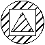
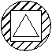
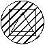

# Создание штриховок

Замкнутые границы могут быть заполнены текстурой по заданному образцу (паттерну), образуя тем самым объект Штриховка. Сперва создается только определение штриховки (объект класса `Hatch`), для него задаются настройки отрисовки (тип штриховки, имя образца/паттерна, флаг ассоциативности). После этого можно указать контур, который будет являться внешней границей штриховки. Затем можно указать любые внутренние контуры, которые могут быть внутри штриховки. 
<b>Внимание</b>: после создания определения штриховки изменить её свойство ассоциативности будет не возможно. 

## Ассоциативность штриховок

Вы можете создавать ассоциативные или неассоциативные штриховки. Ассоциативные штриховки будут связаны со своими границами и обновлятся при изменении границ. Неассоциативные штриховки соответственно не будут авто-изменены при изменении геометрии границ. Чтобы сделать штриховку ассоциативной, установите свойство Associative созданного объекта штриховки в значение true. Чтобы сделать штриховку неассоциативной, установите свойство Associative в значение false. Ассоциативность штриховки должна быть установлена ​​до добавления в штриховку контуров. Чтобы сделать объект штриховки ассоциативным, установите свойство Associative в значение true, удалите объект из состава контура штриховки (RemoveLoopAt) и добавьте этот объект снова (AppendLoop). 

## Особенности задания образца штриховки

nanoCAD предоставляет сплошную заливку (SOLID) и десятки иных стандартных образцов штриховок. Разные стили образцов способны облегчить работу с визуальной идентификацией объектов. Возможно использовать образцы штриховок из поставки AutoCAD, либо из внешних подключаемых файлов. Чтобы задать пользовательский образец штриховки, необходимо указать как тип образца (гдеAutoCAD'у его искать), так и наименование самого образца штриховки. Тип образца определяет, где искать имя данного образца штриховки. При вводе типа образца используйте одну из следующих констант: 

* `HatchPatternType.PreDefined`: имя образца штриховки из файлов acad.pat или acadiso.pat; 

* `HatchPatternType.UserDefined`: используется шаблон в соответствии с текущим свойством Linetype; 

* `HatchPatternType.CustomDefined`: имя образца штриховки ищется в подключенных PAT файлах кроме системных acad.pat и acadiso.pat; 
  При вводе имени образца используйте имя, допустимое для файла:определения штриховки в соответствии с её типом, указанным выше. 
  
  ## Задание границ штриховке
  
  После создания определения штриховки Hatch можно добавить к ней границы. Границы могут представлять собой любую комбинацию линий, дуг, окружностей, двумерных полилиний, эллипсов, сплайнов и областей (Region). Первая добавленная граница должна быть внешней, определяющей крайние контуры, которые будут заполнены штриховкой. Для добавления внешней границы используйте метод AppendLoop с константой HatchLoopTypes.Outermost, указывающей тип добавляемой границы. После определения внешней границы можно продолжить добавление дополнительных границ. Добавьте внутренние границы, используя метод AppendLoop с константой HatchLoopTypes.Default. Внутренние границы определяют "острова" внутри штриховки. Способ обработки этих "островов" объектом Hatch зависит от значения свойства HatchStyle. Свойство HatchStyle может быть установлено в одно из следующих значений: 
  
  | Схема действия                            | Поведение                                 | Описание                                                                                                                                                                                                                                           |
  | ----------------------------------------- | ----------------------------------------- | -------------------------------------------------------------------------------------------------------------------------------------------------------------------------------------------------------------------------------------------------- |
  |  | Обычная (HatchStyle.Normal)               | Задает стандартный стиль -- значение по умолчанию для свойства HatchStyle. Этот параметр заштриховывает область "снаружи -- внутрь". Если nanoCAD встречает внутреннюю границу, он отключает штриховку до тех пор, пока не встретит другую границу |
  |  | Только внешние границы (HatchStyle.Outer) | Заполняет только самые внешние области. Этот стиль также штрихует по пути "снаружи -- внутрь", но отключает штриховку, если встречает внутреннюю границу, и не включает её снова.                                                                  |
  |  | Пропуск (HatchStyle.Ignore)               | Игнорирует внутреннюю структуру. Этот параметр заштриховывает все внутренние контуры                                                                                                                                                               |

После завершения определения штриховки её необходимо перестроить, прежде чем она сможет отобразиться. Для этого используйте метод EvaluateHatch(true).

```csharp
using Autodesk.AutoCAD.Runtime;
using Autodesk.AutoCAD.ApplicationServices;
using Autodesk.AutoCAD.DatabaseServices;
using Autodesk.AutoCAD.Geometry;

[CommandMethod("AddHatch")]
public static void AddHatch()
{
    // Get the current document and database
    Document acDoc = Application.DocumentManager.MdiActiveDocument;
    Database acCurDb = acDoc.Database;

    // Start a transaction
    using (Transaction acTrans = acCurDb.TransactionManager.StartTransaction())
    {
        // Open the Block table for read
        BlockTable acBlkTbl;
        acBlkTbl = acTrans.GetObject(acCurDb.BlockTableId,
                                        OpenMode.ForRead) as BlockTable;

        // Open the Block table record Model space for write
        BlockTableRecord acBlkTblRec;
        acBlkTblRec = acTrans.GetObject(acBlkTbl[BlockTableRecord.ModelSpace],
                                        OpenMode.ForWrite) as BlockTableRecord;

        // Create a circle object for the closed boundary to hatch
        using (Circle acCirc = new Circle())
        {
            acCirc.Center = new Point3d(3, 3, 0);
            acCirc.Radius = 1;

            // Add the new circle object to the block table record and the transaction
            acBlkTblRec.AppendEntity(acCirc);
            acTrans.AddNewlyCreatedDBObject(acCirc, true);

            // Adds the circle to an object id array
            ObjectIdCollection acObjIdColl = new ObjectIdCollection();
            acObjIdColl.Add(acCirc.ObjectId);

            // Create the hatch object and append it to the block table record
            using (Hatch acHatch = new Hatch())
            {
                acBlkTblRec.AppendEntity(acHatch);
                acTrans.AddNewlyCreatedDBObject(acHatch, true);

                // Set the properties of the hatch object
                // Associative must be set after the hatch object is appended to the 
                // block table record and before AppendLoop
                acHatch.SetHatchPattern(HatchPatternType.PreDefined, "ANSI31");
                acHatch.Associative = true;
                acHatch.AppendLoop(HatchLoopTypes.Outermost, acObjIdColl);
                acHatch.EvaluateHatch(true);
            }
        }

        // Save the new object to the database
        acTrans.Commit();
    }
}
```

**Примечание**: настоящая статья является суммой оригинальной "Create Hatches (.NET)" со всеми 4 разделами.
