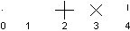
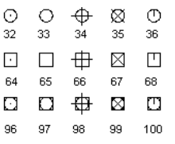

# Создание точечных объектов

Точечные объекты могут быть полезны, например, при использовании в качестве опорных точек, к которым можно привязываться при построении иной геометрии. Вы можете задать стиль точки и ее размер в % относительно рабочей области экрана или в абсолютных единицах. Свойства `Pdmode` и `Pdsize` объекта Database управляют внешним видом точечных объектов. Значения 0, 2, 3 и 4 для Pdmode задают фигуру (условный знак), которая будет отображаться на месте точки. Значение 1 означает, что точка не будет иметь отображения. 



Добавление 32, 64 или 96 к значениям (0..4) с картинки выше приводит к отрисовке определенной фигуры поверх базового обозначения (0..4). 



Параметр `Pdsize` управляет размером точечной фигуры, за исключением случаев, когда Pdmode равен 0 и 1. Значение 0 определяет размер точки, составляющий 5 процентов от высоты текущей графической области. Положительное значение Pdsize задает абсолютный размер точечной фигуры. Отрицательное значение интерпретируется как процент от размера области экрана. После изменения значений `Pdmode` и `Pdsize` внешний вид существующих точек изменится при следующем обновлении чертежа (при вызове команд РЕГЕН\\ВСЕРЕГЕН) 

## Создание точки и смена её визуального стиля

Код ниже создает точечный объект в пространстве Модели в координатах (5, 5, 0). Редактируются отображения точки `Pdmode` и `Pdsize`. 

```cs
using Autodesk.AutoCAD.Runtime;
using Autodesk.AutoCAD.ApplicationServices;
using Autodesk.AutoCAD.DatabaseServices;
using Autodesk.AutoCAD.Geometry;

[CommandMethod("AddPointAndSetPointStyle")]
public static void AddPointAndSetPointStyle()
{
    // Get the current document and database
    Document acDoc = Application.DocumentManager.MdiActiveDocument;
    Database acCurDb = acDoc.Database;

    // Start a transaction
    using (Transaction acTrans = acCurDb.TransactionManager.StartTransaction())
    {
        // Open the Block table for read
        BlockTable acBlkTbl;
        acBlkTbl = acTrans.GetObject(acCurDb.BlockTableId,
                                        OpenMode.ForRead) as BlockTable;

        // Open the Block table record Model space for write
        BlockTableRecord acBlkTblRec;
        acBlkTblRec = acTrans.GetObject(acBlkTbl[BlockTableRecord.ModelSpace],
                                        OpenMode.ForWrite) as BlockTableRecord;

        // Create a point at (4, 3, 0) in Model space
        using (DBPoint acPoint = new DBPoint(new Point3d(4, 3, 0)))
        {
            // Add the new object to the block table record and the transaction
            acBlkTblRec.AppendEntity(acPoint);
            acTrans.AddNewlyCreatedDBObject(acPoint, true);
        }

        // Set the style for all point objects in the drawing
        acCurDb.Pdmode = 34;
        acCurDb.Pdsize = 1;

        // Save the new object to the database
        acTrans.Commit();
    }
}
```
