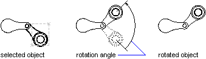

# Операция поворота

Вы можете вращать все объекты чертежа и определения атрибутов вдоль заданного вектора. 

Чтобы повернуть объект, используйте функцию `Rotation` матрицы преобразования. Эта функция требует угла поворота, выраженного в радианах, оси поворота и базовой точки. Ось поворота должна быть выражена как объект Vector3d, а базовая точка — как объект Point3d. Этот угол определяет, насколько объект поворачивается вокруг базовой точки относительно своего текущего местоположения. Положительные значения угла соответствуют повороту против часовой стрелки. 



## Поворот полилинии вокруг базовой точки

Код ниже поворачивает плоскую полилинию на угол 45 градусов вокруг точки (4, 4.25, 0). 

```cs
using Autodesk.AutoCAD.Runtime;
using Autodesk.AutoCAD.ApplicationServices;
using Autodesk.AutoCAD.DatabaseServices;
using Autodesk.AutoCAD.Geometry;

[CommandMethod("RotateObject")]
public static void RotateObject()
{
    // Get the current document and database
    Document acDoc = Application.DocumentManager.MdiActiveDocument;
    Database acCurDb = acDoc.Database;
    // Start a transaction
    using (Transaction acTrans = acCurDb.TransactionManager.StartTransaction())
    {
        // Open the Block table for read
        BlockTable acBlkTbl;
        acBlkTbl = acTrans.GetObject(acCurDb.BlockTableId,
                                     OpenMode.ForRead) as BlockTable;
        // Open the Block table record Model space for write
        BlockTableRecord acBlkTblRec;
        acBlkTblRec = acTrans.GetObject(acBlkTbl[BlockTableRecord.ModelSpace],
                                        OpenMode.ForWrite) as BlockTableRecord;
        // Create a lightweight polyline
        using (Polyline acPoly = new Polyline())
        {
            acPoly.AddVertexAt(0, new Point2d(1, 2), 0, 0, 0);
            acPoly.AddVertexAt(1, new Point2d(1, 3), 0, 0, 0);
            acPoly.AddVertexAt(2, new Point2d(2, 3), 0, 0, 0);
            acPoly.AddVertexAt(3, new Point2d(3, 3), 0, 0, 0);
            acPoly.AddVertexAt(4, new Point2d(4, 4), 0, 0, 0);
            acPoly.AddVertexAt(5, new Point2d(4, 2), 0, 0, 0);
            // Close the polyline
            acPoly.Closed = true;
            Matrix3d curUCSMatrix = acDoc.Editor.CurrentUserCoordinateSystem;
            CoordinateSystem3d curUCS = curUCSMatrix.CoordinateSystem3d;
            // Rotate the polyline 45 degrees, around the Z-axis of the current UCS
            // using a base point of (4,4.25,0)
            acPoly.TransformBy(Matrix3d.Rotation(0.7854,
                                                 curUCS.Zaxis,
                                                 new Point3d(4, 4.25, 0)));
            // Add the new object to the block table record and the transaction
            acBlkTblRec.AppendEntity(acPoly);
            acTrans.AddNewlyCreatedDBObject(acPoly, true);
        }
        // Save the new objects to the database
        acTrans.Commit();
    }
}
```
