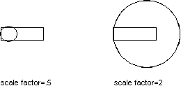

# Операция масштабирования

Масштабирование объекта осуществляется путем указания базовой точки и коэффициента масштабирования в текущих единицах чертежа. 

Можно применять масштабирование ко всем объектам чертежа, а также к определениям атрибутов. Для масштабирования объекта используйте функцию Scaling матрицы преобразования. Эта функция требует числового значения коэффициента масштабирования объекта и объекта Point3d для задания базовой точки. Функция Scaling масштабирует объект одинаково по направлениям X, Y и Z. Размеры объекта умножаются на коэффициент масштабирования. Коэффициент масштабирования больше 1 увеличивает объект. Коэффициент масштабирования от 0 до 1 уменьшает объект. 


**Примечание**: Если вам нужно масштабировать объект неравномерно (то есть на разные значения по осям X, Y, Z), вам необходимо инициализировать матрицу преобразования самостоятельно, используя соответствующий массив данных, а затем использовать метод TransformBy. 



## Масштабирование полилинии

Код ниже уменьшает созданную полилинию в 4 раза (коэффициент масштабирования = 0.25) относительно базовой точки (4,4.25,0). 

```cs
using Autodesk.AutoCAD.Runtime;
using Autodesk.AutoCAD.ApplicationServices;
using Autodesk.AutoCAD.DatabaseServices;
using Autodesk.AutoCAD.Geometry;

[CommandMethod("ScaleObject")]
public static void ScaleObject()
{
    // Get the current document and database
    Document acDoc = Application.DocumentManager.MdiActiveDocument;
    Database acCurDb = acDoc.Database;

    // Start a transaction
    using (Transaction acTrans = acCurDb.TransactionManager.StartTransaction())
    {
        // Open the Block table for read
        BlockTable acBlkTbl;
        acBlkTbl = acTrans.GetObject(acCurDb.BlockTableId,
                                     OpenMode.ForRead) as BlockTable;

        // Open the Block table record Model space for write
        BlockTableRecord acBlkTblRec;
        acBlkTblRec = acTrans.GetObject(acBlkTbl[BlockTableRecord.ModelSpace],
                                        OpenMode.ForWrite) as BlockTableRecord;

        // Create a lightweight polyline
        using (Polyline acPoly = new Polyline())
        {
            acPoly.AddVertexAt(0, new Point2d(1, 2), 0, 0, 0);
            acPoly.AddVertexAt(1, new Point2d(1, 3), 0, 0, 0);
            acPoly.AddVertexAt(2, new Point2d(2, 3), 0, 0, 0);
            acPoly.AddVertexAt(3, new Point2d(3, 3), 0, 0, 0);
            acPoly.AddVertexAt(4, new Point2d(4, 4), 0, 0, 0);
            acPoly.AddVertexAt(5, new Point2d(4, 2), 0, 0, 0);

            // Close the polyline
            acPoly.Closed = true;

            // Reduce the object by a factor of 0.5 
            // using a base point of (4,4.25,0)
            acPoly.TransformBy(Matrix3d.Scaling(0.5, new Point3d(4, 4.25, 0)));

            // Add the new object to the block table record and the transaction
            acBlkTblRec.AppendEntity(acPoly);
            acTrans.AddNewlyCreatedDBObject(acPoly, true);
        }

        // Save the new objects to the database
        acTrans.Commit();
    }
}
```
