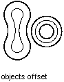

Операция смещения (подобия), примененная к объекту, создает новый объект на заданном расстоянии от данного. Вы можете применять операцию смещения к дугам, окружностям, эллипсам, отрезкам, плоским полилиниям, сплайнам, прямым. 

Для того, чтобы получить смещённый объект, вызовите метод `GetOffsetCurves` у исходного объекта. Метод ожидает положительное или отрицательное "расстояние смещения". Если значение отрицательное, то сдвиг идёт в сторону образования "меньшей" фигуры с меньшими радиусами кривых (в отношении контура сдвиг внутрь); в противном случае (отрицательная величина) -- в сторону увеличения фигуры (в отношении контура сдвиг наружу). 

Если введенное положительное расстояние сдвига (приводящее к созданию уменьшенной фигуры) будет слишком мало для геометрически-корректной операции смещения исходной фигуры, то величина сдвига будет автоматически уменьшена. 



Для многих объектов результатом этой операции будет одна кривая (тип которой может быть и отличен от типа смещаемого объекта). Например, смещение эллипса приведет к получению сплайна, поскольку результирующая кривая не будет соответствовать уравнению эллипса. В некоторых случаях результатом смещения может быть несколько кривых. По этой причине функция возвращает объект DBObjectCollection, который содержит все кривые, созданные в результате смещения кривой. 

Необходимо будет самостоятельно пройтись по всем объектам из данной коллекции и добавить их в базу данных чертежа. 

## Создание подобия для полилинии

Код ниже создает плоскую полилинию и выполняет её смещение на заданное расстояние в 0.25 единиц 

```cs
using Autodesk.AutoCAD.Runtime;
using Autodesk.AutoCAD.ApplicationServices;
using Autodesk.AutoCAD.DatabaseServices;
 
[CommandMethod("OffsetObject")]
public static void OffsetObject()
{
    // Get the current document and database
    Document acDoc = Application.DocumentManager.MdiActiveDocument;
    Database acCurDb = acDoc.Database;

    // Start a transaction
    using (Transaction acTrans = acCurDb.TransactionManager.StartTransaction())
    {
        // Open the Block table for read
        BlockTable acBlkTbl;
        acBlkTbl = acTrans.GetObject(acCurDb.BlockTableId,
                                        OpenMode.ForRead) as BlockTable;

        // Open the Block table record Model space for write
        BlockTableRecord acBlkTblRec;
        acBlkTblRec = acTrans.GetObject(acBlkTbl[BlockTableRecord.ModelSpace],
                                        OpenMode.ForWrite) as BlockTableRecord;

        // Create a lightweight polyline
        using (Polyline acPoly = new Polyline())
        {
            acPoly.AddVertexAt(0, new Point2d(1, 1), 0, 0, 0);
            acPoly.AddVertexAt(1, new Point2d(1, 2), 0, 0, 0);
            acPoly.AddVertexAt(2, new Point2d(2, 2), 0, 0, 0);
            acPoly.AddVertexAt(3, new Point2d(3, 2), 0, 0, 0);
            acPoly.AddVertexAt(4, new Point2d(4, 4), 0, 0, 0);
            acPoly.AddVertexAt(5, new Point2d(4, 1), 0, 0, 0);

            // Add the new object to the block table record and the transaction
            acBlkTblRec.AppendEntity(acPoly);
            acTrans.AddNewlyCreatedDBObject(acPoly, true);

            // Offset the polyline a given distance
            DBObjectCollection acDbObjColl = acPoly.GetOffsetCurves(0.25);

            // Step through the new objects created
            foreach (Entity acEnt in acDbObjColl)
            {
                // Add each offset object
                acBlkTblRec.AppendEntity(acEnt);
                acTrans.AddNewlyCreatedDBObject(acEnt, true);
            }
        }

        // Save the new objects to the database
        acTrans.Commit();
    }
}
```