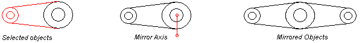
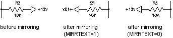

Зеркальное отражение переворачивает объект по оси или линии зеркального отражения. 

Зеркальное отражение можно применять ко всем объектам чертежа. Для зеркального отражения объекта используйте функцию Mirroring матрицы преобразования. Для этой функции требуется объект Point3d, Plane (плоскость, для случая трехмерного отзеркаливания) или Line3d для задания линии зеркального отражения. Поскольку зеркальное отражение выполняется с помощью матрицы преобразования, оно приводит к изменению текущего объекта. Если вы хотите сохранить исходный объект, вам необходимо сначала создать копию объекта, а затем выполнить его зеркальное отражение.

 

Для управления свойствами отражения текстовых объектов используйте системную переменную MIRRTEXT. По умолчанию для MIRRTEXT установлено значение Вкл. (1), что приводит к зеркальному отражению текстовых объектов, как и любых других объектов. Когда для MIRRTEXT установлено значение Выкл. (0), текст не отражается. Для получения и задания параметра MIRRTEXT используйте методы GetSystemVariable и SetSystemVariable соответственно у статического класса Application. 



Вы можете отзеркалить объект выдового экрана Viewport в пространстве чертежа, но это не повлияет на захватываемую им область в пространстве модели или на объекты пространства модели в нём. 

## Отзеркаливание полилинии вдоль оси

Код ниже создает полилинию, делает её копию и производит отражение вдоль отрезка, заданной точками (0, 4.25, 0) и (4, 4.25, 0). Отзеркаленная копия полилинии окрашивается в голубой цвет. 

```cs
using Autodesk.AutoCAD.Runtime;
using Autodesk.AutoCAD.ApplicationServices;
using Autodesk.AutoCAD.DatabaseServices;
using Autodesk.AutoCAD.Geometry;
 
[CommandMethod("MirrorObject")]
public static void MirrorObject()
{
    // Get the current document and database
    Document acDoc = Application.DocumentManager.MdiActiveDocument;
    Database acCurDb = acDoc.Database;

    // Start a transaction
    using (Transaction acTrans = acCurDb.TransactionManager.StartTransaction())
    {
        // Open the Block table for read
        BlockTable acBlkTbl;
        acBlkTbl = acTrans.GetObject(acCurDb.BlockTableId,
                                        OpenMode.ForRead) as BlockTable;

        // Open the Block table record Model space for write
        BlockTableRecord acBlkTblRec;
        acBlkTblRec = acTrans.GetObject(acBlkTbl[BlockTableRecord.ModelSpace],
                                        OpenMode.ForWrite) as BlockTableRecord;

        // Create a lightweight polyline
        using (Polyline acPoly = new Polyline())
        {
            acPoly.AddVertexAt(0, new Point2d(1, 1), 0, 0, 0);
            acPoly.AddVertexAt(1, new Point2d(1, 2), 0, 0, 0);
            acPoly.AddVertexAt(2, new Point2d(2, 2), 0, 0, 0);
            acPoly.AddVertexAt(3, new Point2d(3, 2), 0, 0, 0);
            acPoly.AddVertexAt(4, new Point2d(4, 4), 0, 0, 0);
            acPoly.AddVertexAt(5, new Point2d(4, 1), 0, 0, 0);

            // Create a bulge of -2 at vertex 1
            acPoly.SetBulgeAt(1, -2);

            // Close the polyline
            acPoly.Closed = true;

            // Add the new object to the block table record and the transaction
            acBlkTblRec.AppendEntity(acPoly);
            acTrans.AddNewlyCreatedDBObject(acPoly, true);

            // Create a copy of the original polyline
            Polyline acPolyMirCopy = acPoly.Clone() as Polyline;
            acPolyMirCopy.ColorIndex = 5;

            // Define the mirror line
            Point3d acPtFrom = new Point3d(0, 4.25, 0);
            Point3d acPtTo = new Point3d(4, 4.25, 0);
            Line3d acLine3d = new Line3d(acPtFrom, acPtTo);

            // Mirror the polyline across the X axis
            acPolyMirCopy.TransformBy(Matrix3d.Mirroring(acLine3d));

            // Add the new object to the block table record and the transaction
            acBlkTblRec.AppendEntity(acPolyMirCopy);
            acTrans.AddNewlyCreatedDBObject(acPolyMirCopy, true);
        }

        // Save the new objects to the database
        acTrans.Commit();
    }
}
```