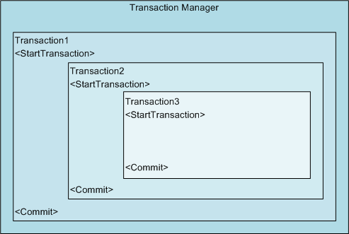

Транзакции могут быть вложены одна в другую. У вас может быть внешняя (основная) транзакция для отмены всех изменений, сделанных одной или несколькими внутренними транзакциями, как и внутренние транзакции могут использоваться для отмены только части сделанных изменений. При работе с вложенными транзакциями, они фигурируют в коде в теле родительской транзакции. Когда вы начинаете новые транзакции, они добавляются в предыдущую транзакцию. Вложенные транзакции должны быть зафиксированы (Commit) или прерваны (Abort) в порядке, обратном порядку их создания. Так, если у вас есть три транзакции, вы должны сперва закрыть третью, самую внутреннюю, потом вторую и, наконец, первую. Если вы прервете первую транзакцию, изменения, внесенные всеми тремя транзакциями, будут отменены. На следующей иллюстрации показано, как выглядят вложенные транзакции. 



## Использование вложенных транзакций для создания и редактирования объектов

Пример ниже содержит 3 транзакции для последовательного создания примитивов окружности и отрезка с последующим редактированием их цветов. Цвет окружности меняется в рамках второй и третьей транзакции, но поскольку третья транзакция может прерваться (см. использование GetKeywords), то будут применены только изменения внесенные в рамках первой и второй транзакций. Кроме того, количество активных транзакций выводится в лог командной строки по мере их создания и закрытия. 

```cs
using Autodesk.AutoCAD.Runtime;
using Autodesk.AutoCAD.ApplicationServices;
using Autodesk.AutoCAD.DatabaseServices;
using Autodesk.AutoCAD.Geometry;
using Autodesk.AutoCAD.EditorInput;
 
[CommandMethod("NestedTransactions")]
public static void NestedTransactions()
{
    // Get the current document and database
    Document acDoc = Application.DocumentManager.MdiActiveDocument;
    Database acCurDb = acDoc.Database;

    // Create a reference to the Transaction Manager
    Autodesk.AutoCAD.DatabaseServices.TransactionManager acTransMgr;
    acTransMgr = acCurDb.TransactionManager;

    // Create a new transaction
    using (Transaction acTrans1 = acTransMgr.StartTransaction())
    {
        // Print the current number of active transactions
        acDoc.Editor.WriteMessage("\nNumber of transactions active: " +
                                    acTransMgr.NumberOfActiveTransactions.ToString());

        // Open the Block table for read
        BlockTable acBlkTbl;
        acBlkTbl = acTrans1.GetObject(acCurDb.BlockTableId,
                                        OpenMode.ForRead) as BlockTable;

        // Open the Block table record Model space for write
        BlockTableRecord acBlkTblRec;
        acBlkTblRec = acTrans1.GetObject(acBlkTbl[BlockTableRecord.ModelSpace],
                                            OpenMode.ForWrite) as BlockTableRecord;

        // Create a circle with a radius of 3 at 5,5
        using (Circle acCirc = new Circle())
        {
            acCirc.Center = new Point3d(5, 5, 0);
            acCirc.Radius = 3;

            // Add the new object to Model space and the transaction
            acBlkTblRec.AppendEntity(acCirc);
            acTrans1.AddNewlyCreatedDBObject(acCirc, true);

            // Create the second transaction
            using (Transaction acTrans2 = acTransMgr.StartTransaction())
            {
                acDoc.Editor.WriteMessage("\nNumber of transactions active: " +
                                            acTransMgr.NumberOfActiveTransactions.ToString());

                // Change the circle's color
                acCirc.ColorIndex = 5;

                // Get the object that was added to Transaction 1 and set it to the color 5
                using (Line acLine = new Line(new Point3d(2, 5, 0), new Point3d(10, 7, 0)))
                {
                    acLine.ColorIndex = 3;

                    // Add the new object to Model space and the transaction
                    acBlkTblRec.AppendEntity(acLine);
                    acTrans2.AddNewlyCreatedDBObject(acLine, true);
                }

                // Create the third transaction
                using (Transaction acTrans3 = acTransMgr.StartTransaction())
                {
                    acDoc.Editor.WriteMessage("\nNumber of transactions active: " +
                                                acTransMgr.NumberOfActiveTransactions.ToString());

                    // Change the circle's color
                    acCirc.ColorIndex = 3;

                    // Update the display of the drawing
                    acDoc.Editor.WriteMessage("\n");
                    acDoc.Editor.Regen();

                    // Request to keep or discard the changes in the third transaction
                    PromptKeywordOptions pKeyOpts = new PromptKeywordOptions("");
                    pKeyOpts.Message = "\nKeep color change ";
                    pKeyOpts.Keywords.Add("Yes");
                    pKeyOpts.Keywords.Add("No");
                    pKeyOpts.Keywords.Default = "No";
                    pKeyOpts.AllowNone = true;

                    PromptResult pKeyRes = acDoc.Editor.GetKeywords(pKeyOpts);

                    if (pKeyRes.StringResult == "No")
                    {
                        // Discard the changes in transaction 3
                        acTrans3.Abort();
                    }
                    else
                    {
                        // Save the changes in transaction 3
                        acTrans3.Commit();
                    }

                    // Dispose the transaction
                }

                acDoc.Editor.WriteMessage("\nNumber of transactions active: " +
                                            acTransMgr.NumberOfActiveTransactions.ToString());

                // Keep the changes to transaction 2
                acTrans2.Commit();
            }
        }

        acDoc.Editor.WriteMessage("\nNumber of transactions active: " +
                                    acTransMgr.NumberOfActiveTransactions.ToString());

        // Keep the changes to transaction 1
        acTrans1.Commit();
    }
}
```