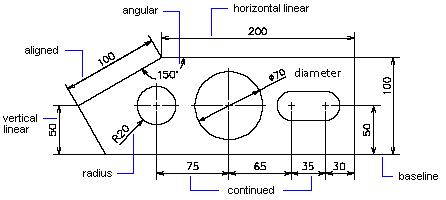

# Принцип работы размеров

Размеры показывают геометрические характеристики объектов, величины расстояния или углов между объектами, либо координаты X и Y элемента. Имеется три основных типа размеров: линейные, радиальные и угловые. 

Вы можете образмеривать линии, мультиинии, дуги, окружности и сегменты полилиний, а также создавать размеры, не привязанные к каким-либо элементам чертежа. 

Все размеры по умолчанию размещаются на активном слое. Каждый размер имеет связанный с ним размерный стиль, будь то стиль по умолчанию или стиль, который вы определили программно. Стиль задает такие характеристики, как цвет, стиль текста, тип наконечников стрелок и масштаб элементов анотации в размере. Размеры не учитывают толщину объекта.
