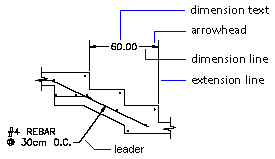
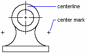

Размеры могут состоять из множества различных объектов, таких как линии, текст, заливки и блоки. Хоть каждый из видов размера имеет свои особенности, тем не менее у всех размеров есть общие части: 

* Dimension line : отрезок, определяющий направление и область охвата размера. Для угловых размеров этот отрезок превращается в дугу; 
* Extension line : линия продолжения опорной измерительной плоскости размера (между какими элементами объекта размер создан); 
* Arrowhead : символы:указатели стрелок размерной линии; 
* Dimension text : текстовая строка, содержащая результат измерения; 
* Leader : плоская линия с полкой, связывающая размер с объектом, в случае когда размер для читаемости удален от объекта; 

* Center mark : крестик, обозначающий центр окружности или круговой дуги; 
* Centerline : набор прерывистых линий, обозначающих центр окружности или круговой дуги;