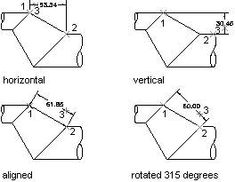

# Создание линейных размеров

Линейные размеры могут быть параллельными (описываются классом AlignedDimension) или нет (описываются классом RotatedDimension); в первом случае размерная линия параллельна измеряемой линии у объекта, во втором случае она лежит под некоторым углом по отношению к объекту. 

После создания экземпляра класса линейного размера (AlignedDimension или RotatedDimension) ему можно задать текст, угол наклона текста или угол наклона размерной линии. На следующих иллюстрациях показано, как тип линейного размера и расположение начальных точек удлинительной линии влияют на угол наклона размерной линии и текста. 



При создании экземпляра класса AlignedDimension можно указать начало удлинительной линии, расположение размерной линии, текст размера и стиль размера. Если в конструктор объекта AlignedDimension не передать никаких параметров, объекту будет назначен набор значений свойств по умолчанию. Конструктор класса RotatedDimension предлагает те же параметры, что и конструктор AlignedDimension, за одним исключением. Конструктор объекта RotatedDimension принимает дополнительный параметр, который задает угол поворота размерной линии. 

**Размерная линия** на линейных размерах добавляется не через набор свойств, а через расширенные данные (Xdata). Имя приложения, отвечающего за размерную линию — ACAD_DSTYLE_DIMJAG_POSITION. Ниже приведен пример структуры Xdata, которую необходимо добавить к линейному размеру. 

В примере ниже создается простой повернутый размер в пространстве модели с размерными линиями.

```cs
using Autodesk.AutoCAD.Runtime;
using Autodesk.AutoCAD.ApplicationServices;
using Autodesk.AutoCAD.DatabaseServices;
using Autodesk.AutoCAD.Geometry;

[CommandMethod("CreateRotatedDimension")]
public static void CreateRotatedDimension()
{
    // Get the current database
    Document acDoc = Application.DocumentManager.MdiActiveDocument;
    Database acCurDb = acDoc.Database;
    // Start a transaction
    using (Transaction acTrans = acCurDb.TransactionManager.StartTransaction())
    {
        // Open the Block table for read
        BlockTable acBlkTbl;
        acBlkTbl = acTrans.GetObject(acCurDb.BlockTableId,
                                        OpenMode.ForRead) as BlockTable;
        // Open the Block table record Model space for write
        BlockTableRecord acBlkTblRec;
        acBlkTblRec = acTrans.GetObject(acBlkTbl[BlockTableRecord.ModelSpace],
                                        OpenMode.ForWrite) as BlockTableRecord;
        // Open the Registered Application table for read
        RegAppTable acRegAppTbl;
        acRegAppTbl = acTrans.GetObject(acCurDb.RegAppTableId,
                                              OpenMode.ForRead) as RegAppTable;
        // Check to see if the app "ACAD_DSTYLE_DIMJAG_POSITION" is
        // registered and if not add it to the RegApp table
        if (acRegAppTbl.Has("ACAD_DSTYLE_DIMJAG_POSITION") == false)
        {
            using (RegAppTableRecord acRegAppTblRec = new RegAppTableRecord())
            {
                acRegAppTblRec.Name = "ACAD_DSTYLE_DIMJAG_POSITION";
                acTrans.GetObject(acCurDb.RegAppTableId, OpenMode.ForWrite);
                acRegAppTbl.Add(acRegAppTblRec);
                acTrans.AddNewlyCreatedDBObject(acRegAppTblRec, true);
            }
        }
        // Create the rotated dimension
        using (RotatedDimension acRotDim = new RotatedDimension())
        {
            acRotDim.XLine1Point = new Point3d(0, 0, 0);
            acRotDim.XLine2Point = new Point3d(6, 3, 0);
            acRotDim.Rotation = 0.707;
            acRotDim.DimLinePoint = new Point3d(0, 5, 0);
            acRotDim.DimensionStyle = acCurDb.Dimstyle;
            // Create a result buffer to define the Xdata
            ResultBuffer acResBuf = new ResultBuffer();
            acResBuf.Add(new TypedValue((int)DxfCode.ExtendedDataRegAppName,
                                                     "ACAD_DSTYLE_DIMJAG_POSITION"));
            acResBuf.Add(new TypedValue((int)DxfCode.ExtendedDataInteger16, 387));
            acResBuf.Add(new TypedValue((int)DxfCode.ExtendedDataInteger16, 3));
            acResBuf.Add(new TypedValue((int)DxfCode.ExtendedDataInteger16, 389));
            acResBuf.Add(new TypedValue((int)DxfCode.ExtendedDataXCoordinate,
                                                     new Point3d(-1.26985, 3.91514, 0)));
            // Attach the Xdata to the dimension
            acRotDim.XData = acResBuf;
            // Add the new object to Model space and the transaction
            acBlkTblRec.AppendEntity(acRotDim);
            acTrans.AddNewlyCreatedDBObject(acRotDim, true);
        }
        // Commit the changes and dispose of the transaction
        acTrans.Commit();
    }
}
```
