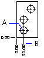

# Создание ординатных размеров

Ординатные, или базовые, размеры измеряют перпендикулярное расстояние от начальной точки, называемой базой, до заданной точки элемента, например, центра отверстия, у измеряемого объекта. 



Ординатные размеры состоят из координат X или Y на выносках. Размеры по ординатам X измеряют расстояние элемента от базовой точки вдоль оси X. Размеры по ординатам Y измеряют такое же расстояние вдоль оси Y. 

Координаты измеряются относительно текущей пользовательской системы координат (ПСК). Используются абсолютные значения координат. Текст размера выравнивается по выноске ординаты независимо от ориентации, заданной текущим размерным стилем. 

Текст размера можно заменить на пользовательский. Создать новый ординатный размер можно с помощью класса OrdinateDimension. У конструктора класса OrdinateDimension имеется перегрузка без параметров и со всеми параметрами; характеристики размера могут быть установлены через свойства: 

* UsingXAxis : признак, создавать ли размер вдоль оси X (аналогично свойство UsingYAxis); 
* DefiningPoint : базовая точка, для которой считается размер; 
* LeaderEndPoint : точка начала полки выноски; 
* DimensionText : текст размера; 
* Стиль размера (свойство DimensionStyleName или DimensionStyle); 

В примере ниже создается ординатный размер в пространстве модели 

```cs
[CommandMethod("CreateOrdinateDimension")]
public static void CreateOrdinateDimension()
{
    // Get the current database
    Document acDoc = Application.DocumentManager.MdiActiveDocument;
    Database acCurDb = acDoc.Database;
    // Start a transaction
    using (Transaction acTrans = acCurDb.TransactionManager.StartTransaction())
    {
        // Open the Block table for read
        BlockTable acBlkTbl;
        acBlkTbl = acTrans.GetObject(acCurDb.BlockTableId,
                                        OpenMode.ForRead) as BlockTable;
        // Open the Block table record Model space for write
        BlockTableRecord acBlkTblRec;
        acBlkTblRec = acTrans.GetObject(acBlkTbl[BlockTableRecord.ModelSpace],
                                        OpenMode.ForWrite) as BlockTableRecord;
        // Create an ordinate dimension
        using (OrdinateDimension acOrdDim = new OrdinateDimension())
        {
            acOrdDim.UsingXAxis = true;
            acOrdDim.DefiningPoint = new Point3d(5, 5, 0);
            acOrdDim.LeaderEndPoint = new Point3d(10, 5, 0);
            acOrdDim.DimensionStyle = acCurDb.Dimstyle;
            // Add the new object to Model space and the transaction
            acBlkTblRec.AppendEntity(acOrdDim);
            acTrans.AddNewlyCreatedDBObject(acOrdDim, true);
        }
        // Commit the changes and dispose of the transaction
        acTrans.Commit();
    }
}
```
