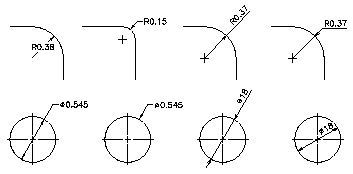

# Создание радиальных размеров

Радиальные размеры предназначены для измерения радиусов и диаметров дуг и окружностей. Радиальные и диаметральные размеры создаются путем создания экземпляров объектов RadialDimension и DiametricDimension соответственно. Существует несколько вариантов отрисовки размеров в зависимости от габаритов измеряемых окружности или дуги, положения текста размера, значений системных переменных размеров DIMUPT, DIMTOFL, DIMTIH, DIMTOH, DIMJUST и DIMTAD (системные переменные можно получить или задать с помощью методов GetSystemVariable и SetSystemVariable соответственно у статического класса Application). 

**Примечание**: переменная DIMFIT в nanoCAD не реализована. 

Для подписи размера, если угол размерной линии составляет 15 градусов и более от горизонтали и находится за пределами окружности или дуги, рисуется вспомогательная линия, называемая выступом или изгибом. Вспомогательная линия размещается рядом с текстом размера или под ним, как показано на картинке ниже: 



При создании экземпляра класса `RadialDimension` у вас будет возможность задать центральную точку и точку на окружности, длину выноски, текст размера и применяемый стиль размера. Создание объекта класса `DiametricDimension` аналогично `RadialDimension`, за исключением того, что вместо центральной точки и точки на окружности указываются крайние точки диаметра (хорды, проходящей через центр дуги или окружности). Свойство `LeaderLength` задает расстояние от точки на окружности до текста аннотации. В примере ниже создается простой радиальный размер в пространстве модели. 

```cs
using Autodesk.AutoCAD.Runtime;
using Autodesk.AutoCAD.ApplicationServices;
using Autodesk.AutoCAD.DatabaseServices;
using Autodesk.AutoCAD.Geometry;

[CommandMethod("CreateRadialDimension")]
public static void CreateRadialDimension()
{
    // Get the current database
    Document acDoc = Application.DocumentManager.MdiActiveDocument;
    Database acCurDb = acDoc.Database;

    // Start a transaction
    using (Transaction acTrans = acCurDb.TransactionManager.StartTransaction())
    {
        // Open the Block table for read
        BlockTable acBlkTbl;
        acBlkTbl = acTrans.GetObject(acCurDb.BlockTableId,
                                        OpenMode.ForRead) as BlockTable;

        // Open the Block table record Model space for write
        BlockTableRecord acBlkTblRec;
        acBlkTblRec = acTrans.GetObject(acBlkTbl[BlockTableRecord.ModelSpace],
                                        OpenMode.ForWrite) as BlockTableRecord;

        // Create the radial dimension
        using (RadialDimension acRadDim = new RadialDimension())
        {
            acRadDim.Center = new Point3d(0, 0, 0);
            acRadDim.ChordPoint = new Point3d(5, 5, 0);
            acRadDim.LeaderLength = 5;
            acRadDim.DimensionStyle = acCurDb.Dimstyle;

            // Add the new object to Model space and the transaction
            acBlkTblRec.AppendEntity(acRadDim);
            acTrans.AddNewlyCreatedDBObject(acRadDim, true);
        }

        // Commit the changes and dispose of the transaction
        acTrans.Commit();
    }
}
```
