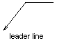

# Создание линий выносок

Вы можете создать выноску из любой точки или для любого элемента чертежа и в дальнейшем отредактировать её вид. Линия выноски может быть как простым отрезком, так и сплайновой кривой. Цвет выноски определяется свойством цвета линии. Масштаб выноски определяется параметром размерного масштаба, заданным в активном размерном стиле. Тип и размер стрелки, если она присутствует на выноске, также определяется активным размерным стилем. 

Небольшая линия, известная как "полка", обычно соединяет аннотацию с выноской. Полки появляются в случае использования многострочного текста, если последний отрезок выноски расположен под углом более 15 градусов к горизонтали. Длина полки равна длине одной стрелки. Если у выноски нет аннотации, то у нее будет отсутствовать и полка. 



Выноска создается путем создания экземпляра класса `Leader`, конструктор класса не принимает никаких параметров, поведение выноски настраивается через свойства и методы класса. Метод `AppendVertex` используется для задания положения и длины создаваемой выноски. 

Пример ниже содержит код для создания выноски без элемента анотации в пространстве модели 

```cs
using Autodesk.AutoCAD.Runtime;
using Autodesk.AutoCAD.ApplicationServices;
using Autodesk.AutoCAD.DatabaseServices;
using Autodesk.AutoCAD.Geometry;

[CommandMethod("CreateLeader")]
public static void CreateLeader()
{
    // Get the current database
    Document acDoc = Application.DocumentManager.MdiActiveDocument;
    Database acCurDb = acDoc.Database;

    // Start a transaction
    using (Transaction acTrans = acCurDb.TransactionManager.StartTransaction())
    {
        // Open the Block table for read
        BlockTable acBlkTbl;
        acBlkTbl = acTrans.GetObject(acCurDb.BlockTableId,
                                        OpenMode.ForRead) as BlockTable;

        // Open the Block table record Model space for write
        BlockTableRecord acBlkTblRec;
        acBlkTblRec = acTrans.GetObject(acBlkTbl[BlockTableRecord.ModelSpace],
                                        OpenMode.ForWrite) as BlockTableRecord;

        // Create the leader
        using (Leader acLdr = new Leader())
        {
            acLdr.AppendVertex(new Point3d(0, 0, 0));
            acLdr.AppendVertex(new Point3d(4, 4, 0));
            acLdr.AppendVertex(new Point3d(4, 5, 0));
            acLdr.HasArrowHead = true;

            // Add the new object to Model space and the transaction
            acBlkTblRec.AppendEntity(acLdr);
            acTrans.AddNewlyCreatedDBObject(acLdr, true);
        }

        // Commit the changes and dispose of the transaction
        acTrans.Commit();
    }
}
```
