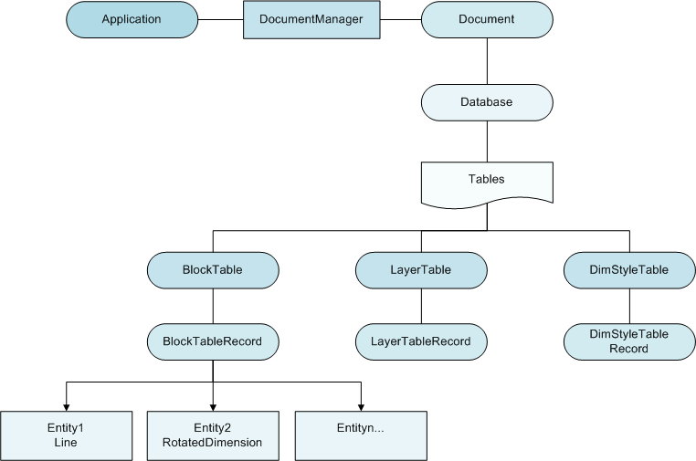

# Введение в иерархию объектов nanoCAD

Минимальная структурная единица модели AutoCAD -- это объект. Некоторые из объектов, с которыми вы будете сталкиваться при работе с настоящим .NET API это: 

* Графические объекты: окружности, текст, полилинии, размеры и пр.; 
* Настройки стилей и свойств документа :: слои, типы линий, типы размеров и т.д.; 
* Коллекции или инструменты компоновки объектов :: слои, группы, блоки; 
* Отображение части модели :: листы и видовые экраны; 
* Сущность документа и приложения nanoCAD. 
* и множество иных категорий объектов; 

Все объекты имеют иерархическую структуру (за счет наследования классов). Упорядоченная структура объектов и есть объектная модель. Верхнеуровневый элемент - это сущность приложения Autodesk.AutoCAD.ApplicationServices.Application. На схеме ниже показаны связи между приложением Application, документом и объектами, находящимися в составе BlockTableRecord, например пространством модели. 

